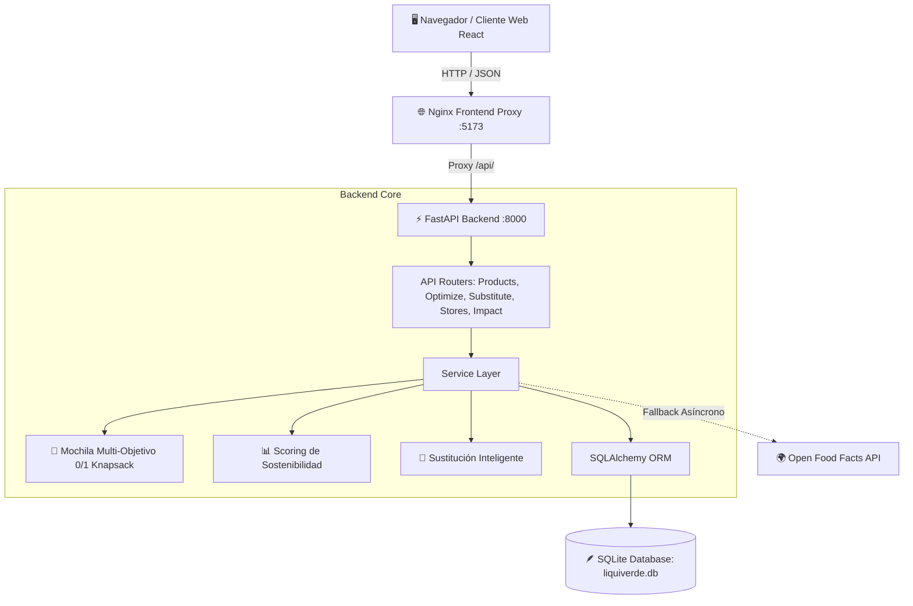

# 🌱 LiquiVerde — Retail Inteligente & Sostenible

> **Desafío Técnico Software Engineer I — Grupo Lagos**  
> Plataforma full-stack para optimización de compras conscientes, maximización del ahorro económico y reducción medible del impacto ambiental y social.

---

## 📋 Tabla de Contenidos
1. [Descripción General](#-descripción-general)
2. [Stack Tecnológico](#-stack-tecnológico)
3. [Arquitectura del Sistema](#-arquitectura-del-sistema)
4. [Explicación Formal de Algoritmos](#-explicación-formal-de-algoritmos)
   - [1. Algoritmo de Mochila Multi-Objetivo](#1-algoritmo-de-mochila-multi-objetivo-knapsack)
   - [2. Sistema de Scoring de Sostenibilidad](#2-sistema-de-scoring-de-sostenibilidad-multicriterio)
   - [3. Motor de Sustitución Inteligente](#3-motor-de-sustitución-inteligente)
5. [Instrucciones de Ejecución](#-instrucciones-de-ejecución)
   - [Opción A: Docker Compose (Recomendada / 1 Comando)](#opción-a-docker-compose-recomendada--1-comando)
   - [Opción B: Ejecución Local Manual](#opción-b-ejecución-local-manual)
6. [Variables de Entorno y Configuración](#-variables-de-entorno-y-configuración)
7. [Documentación de APIs & Swagger](#-documentación-de-apis--swagger)
8. [Suite de Pruebas Automatizadas](#-suite-de-pruebas-automatizadas)
9. [Uso de Inteligencia Artificial (Declaración Obligatoria)](#-uso-de-inteligencia-artificial)

---

## 🚀 Descripción General

LiquiVerde transforma la experiencia de compra en retail al combinar optimización matemática de canastas con evaluación de impacto ambiental de ciclo de vida. Permite a los consumidores:
- **Escanear códigos de barra EAN-13** o buscar productos en tiempo real, integrando el catálogo local con la red global **Open Food Facts**.
- **Optimizar canastas sujetas a presupuesto** mediante un slider dinámico que equilibra *Ahorro Económico* vs. *Sostenibilidad Ecológica*.
- **Recibir recomendaciones automáticas de sustitución** de productos de alto impacto (por ejemplo, reemplazar lácteos en botellas plásticas o carne por alternativas locales de cooperativas campesinas con menor huella de $CO_2$ y menor costo).
- **Visualizar su impacto acumulado** en un dashboard (árboles equivalentes, agua virtual ahorrada, dinero ahorrado).
- **Ubicar tiendas locales y puntos de recarga circular** (cooperativas, dispensadores Algramo) en un mapa interactivo con rutas optimizadas.

---

## 🛠️ Stack Tecnológico

| Capa | Tecnología | Justificación Técnica |
| :--- | :--- | :--- |
| **Backend API** | **Python 3.11+ / FastAPI** | Alto rendimiento asíncrono, validación estricta con **Pydantic v2**, generación automática de documentación interactiva **Swagger UI** y soporte nativo para algoritmos matemáticos. |
| **Frontend** | **React + Vite** | Hot Module Replacement (HMR) ultrarrápido, interfaz reactiva con renderizado dinámico de sliders, integración con **Leaflet** y sistema de diseño visual con microinteracciones. |
| **Base de Datos** | **SQLite + SQLAlchemy 2.0** | Cero fricción de despliegue, portabilidad total, integridad referencial y desacoplamiento para migrar a PostgreSQL con solo cambiar la cadena de conexión. |
| **Contenedores** | **Docker & Docker Compose** | Construcción multi-etapa optimizada (Node + Nginx para frontend, Python-slim para backend) lista para levantar en un solo comando. |
| **Pruebas** | **Pytest** | Cobertura integral de los algoritmos de optimización, scoring y endpoints REST. |

---

## 🏗️ Arquitectura del Sistema



---

## 🧮 Explicación Formal de Algoritmos

El núcleo algorítmico está desacoplado en funciones puras testeables dentro de `backend/app/algorithms/`:

### 1. Algoritmo de Mochila Multi-Objetivo (Knapsack)
- **Ubicación:** [backend/app/algorithms/knapsack.py](file:///backend/app/algorithms/knapsack.py)
- **Problema:** Dado un conjunto de productos candidatos $N$, un presupuesto límite $B$ y una preferencia del usuario $\alpha \in [0, 1]$:
  - $\alpha = 0.0$: Prioridad máxima a la economía (mayor cantidad de productos y menor costo por peso invertido).
  - $\alpha = 1.0$: Prioridad máxima a la sostenibilidad (mayor puntaje ecológico y menor emisión de $CO_2$).
  - $\alpha = 0.5$: Equilibrio inteligente.

- **Función de Utilidad Normalizada para el producto $i$:**
  $$E_i = 0.70 \cdot \left(\frac{Score_i}{100}\right) + 0.30 \cdot \max\left(0, 1 - \frac{CO_{2, i}}{10}\right)$$
  $$U_i = \min\left(100, \frac{2000}{Precio_i} \cdot 50\right)$$
  $$Valor_i(\alpha) = \alpha \cdot E_i + (1 - \alpha) \cdot U_i$$

- **Restricción de Presupuesto:**
  $$\sum_{i \in Canasta} Precio_i \le B$$

- **Resolución:**
  1. **Programación Dinámica (0/1 Knapsack):** Discretiza los precios en pesos para resolver la tabla en tiempo $O(n \cdot \frac{B}{step})$ garantizando la combinación matemáticamente óptima en milisegundos.
  2. **Heurística Greedy (Ratio Beneficio/Costo):** Para catálogos extensos, ordena los productos según la densidad de beneficio $Ratio_i = \frac{Valor_i}{Precio_i}$ y realiza selección voraz en $O(n \log n)$.
  3. **Manejo de Ítems Obligatorios:** Asigna los productos forzados de la canasta primero, restando su costo del presupuesto libre remanente.

---

### 2. Sistema de Scoring de Sostenibilidad Multicriterio
- **Ubicación:** [backend/app/algorithms/scoring.py](file:///backend/app/algorithms/scoring.py)
- **Formulación:** El puntaje final $Score_{total} \in [0, 100]$ evalúa tres dimensiones balanceadas:
  $$Score_{total} = 0.50 \cdot S_{ambiental} + 0.30 \cdot S_{social} + 0.20 \cdot S_{economico}$$

- **Desglose de Subscores:**
  - **$S_{ambiental}$ (50%):**
    $$S_{amb} = 0.45 \cdot \left(1 - \frac{CO_2}{Techo_{cat}}\right) \cdot 100 + 0.35 \cdot Empaque + 0.20 \cdot EcoScore + Bonus_{organico}$$
    Donde empaque premia envases granel/retornables (100) y penaliza plástico no reciclable (15-35), y el Eco-Score traduce los grados oficiales de Open Food Facts (A=100, B=80, C=60, D=40, E=20).
  - **$S_{social}$ (30%):**
    Evalúa origen local y cooperativas campesinas chilenas (95-100 pts) vs. importación transoceánica (30-40 pts) con un bono de **+15 puntos** para certificaciones de Comercio Justo (Fair Trade).
  - **$S_{economico}$ (20%):**
    Compara el precio del producto contra el promedio de su categoría, premiando la accesibilidad económica.

---

### 3. Motor de Sustitución Inteligente
- **Ubicación:** [backend/app/algorithms/substitution.py](file:///backend/app/algorithms/substitution.py)
- Evalúa productos sustitutos de la misma categoría o con equivalencia directa.
- **Cálculo de Deltas en Tiempo Real:**
  $$\Delta Precio = Precio_{original} - Precio_{sustituto} \quad \text{(Ahorro monetario)}$$
  $$\Delta CO_2 = CO_{2, original} - CO_{2, sustituto} \quad \text{(Emisiones mitigadas)}$$
  $$\Delta Agua = Agua_{original} - Agua_{sustituto} \quad \text{(Litros de agua virtual conservados)}$$
  $$\Delta Score = Score_{sustituto} - Score_{original} \quad \text{(Ganancia de sostenibilidad)}$$
- Genera automáticamente explicaciones comprensibles y amigables en lenguaje natural para orientar al consumidor.

---

## 💻 Instrucciones de Ejecución

### Opción A: Docker Compose (Recomendada / 1 Comando)
Asegúrate de tener Docker corriendo y ejecuta desde la raíz del proyecto:

```bash
docker compose up --build
```

- **Frontend Web:** [http://localhost:5173](http://localhost:5173) (o [http://localhost:80](http://localhost:80))
- **API Backend & Swagger:** [http://localhost:8000/docs](http://localhost:8000/docs)

---

### Opción B: Ejecución Local Manual

#### 1. Backend (Python FastAPI)
```bash
# Entrar al directorio de backend
cd backend

# Crear entorno virtual e instalar dependencias
python -m venv venv
venv\Scripts\activate  # En Windows (o source venv/bin/activate en Linux/Mac)
pip install -r requirements.txt

# Inicializar y poblar base de datos SQLite con semillas
python -m app.db.init_db

# Iniciar servidor de desarrollo
uvicorn app.main:app --reload --host 127.0.0.1 --port 8000
```

#### 2. Frontend (React + Vite)
```bash
# En una nueva terminal, entrar a frontend
cd frontend

# Instalar dependencias
npm install

# Iniciar servidor Vite
npm run dev
```

La aplicación estará disponible en [http://localhost:5173](http://localhost:5173).

---

## ⚙️ Variables de Entorno y Configuración

El backend cuenta con valores por defecto listos para desarrollo local y Docker. Opcionalmente se pueden configurar en un archivo `.env`:

| Variable | Valor por defecto | Descripción |
| :--- | :--- | :--- |
| `DATABASE_URL` | `sqlite:///./liquiverde.db` | URL de conexión para SQLite o PostgreSQL |
| `PORT` | `8000` | Puerto de escucha de la API |
| `OFF_USER_AGENT` | `LiquiVerde-Chile-App/1.0` | User-Agent requerido por la API de Open Food Facts |
| `VITE_API_URL` | `http://localhost:8000/api` | URL base de la API para el frontend |

---

## 📖 Documentación de APIs & Swagger

Al levantar el backend, FastAPI genera automáticamente la especificación OpenAPI en:
- **Swagger UI:** [http://localhost:8000/docs](http://localhost:8000/docs)
- **ReDoc:** [http://localhost:8000/redoc](http://localhost:8000/redoc)

### Principales Endpoints:
- `GET /api/products`: Lista filtrada por texto, categoría, grado Eco-Score, orgánico o comercio justo.
- `GET /api/products/barcode/{barcode}`: Búsqueda y escaneo por código EAN-13 (con fallback asíncrono a Open Food Facts).
- `GET /api/products/{id}`: Detalle de producto con métricas ambientales.
- `POST /api/optimize/knapsack`: Optimización de canasta con algoritmo de mochila multi-objetivo.
- `GET /api/substitutes/{id}`: Sugerencias de alternativas ecológicas y económicas con cálculo de deltas.
- `GET /api/stores`: Puntos de venta sustentables, granel y cooperativas con coordenadas geográficas.
- `GET /api/impact/summary`: Métricas agregadas de impacto ambiental y económico.

---

## 🧪 Suite de Pruebas Automatizadas

El proyecto cuenta con pruebas unitarias y de integración que validan los algoritmos y los contratos HTTP:

```bash
# Ejecutar suite de pruebas con pytest desde la raíz
backend\venv\Scripts\pytest backend/tests
```

**Resultado de las pruebas:**
- `test_knapsack.py`: Validación del cumplimiento estricto del presupuesto ($\sum Precio_i \le B$), caso de presupuesto insuficiente, sensibilidad del slider $\alpha$, productos obligatorios y método voraz.
- `test_scoring.py`: Validación de cotas de puntaje ($0 \le score \le 100$), bonificación de comercio justo, sensibilidad a precios relativos y consistencia de la fórmula.
- `test_substitution.py`: Verificación de cálculo de ahorros, mitigación de $CO_2$ y aislamiento por categorías.
- `test_api.py`: Pruebas de integración para todos los endpoints HTTP de la API REST.

```
======================= 20 passed in 0.77s ========================
```

---

## 🤖 Uso de Inteligencia Artificial

> **Sección requerida por las bases del Desafío Técnico de Grupo Lagos:**  
> En cumplimiento con el punto 2 de los *Entregables Obligatorios*, a continuación se detalla de manera transparente el uso y asistencia recibida de herramientas de Inteligencia Artificial durante el desarrollo del proyecto.

### Herramientas Utilizadas
- **Modelo:** Google DeepMind Gemini (Arquitectura de asistencia de código avanzada vía Antigravity IDE).

### Asistencia Recibida
1. **Modelado y Formulación Matemática:**
   - Asistencia en la formulación de la función de aptitud del **Problema de la Mochila Multi-Objetivo (0/1 Multi-objective Knapsack)**, parametrizando el balance entre el factor de sostenibilidad ecológica ($E_i$) y el valor por peso invertido ($U_i$).
   - Estructuración de la fórmula del **Índice de Sostenibilidad Ponderado** en sus tres dimensiones ($50\%$ Ambiental, $30\%$ Social, $20\%$ Económica).
2. **Generación de Datasets Realistas:**
   - Compilación y curaduría del dataset de productos chilenos en [data/products_seed.json](file:///data/products_seed.json), asociando códigos EAN-13 reales, huellas de carbono estimadas con datos de ciclo de vida (LCA de Agribalyse) y precios en pesos chilenos.
   - Creación del dataset de tiendas sustentables de Santiago en [data/stores_seed.json](file:///data/stores_seed.json) con coordenadas geográficas para Leaflet.
3. **Desarrollo Full-Stack Acelerado:**
   - Creación de la estructura modular de la API en FastAPI (`models`, `schemas`, `algorithms`, `api`, `services`).
   - Implementación del sistema de diseño moderno con Vanilla CSS (paleta ecológica, glassmorphism de alto contraste y microinteracciones).
   - Orquestación y configuración de contenedores Docker multi-etapa y `docker-compose.yml`.
4. **Validación y Pruebas:**
   - Generación de casos de prueba con `pytest` para verificar casos de borde algorítmicos (presupuesto insuficiente, empates en ratios y consistencia de sustitución).

---

© 2026 LiquiVerde • Retail Inteligente & Sostenible.
