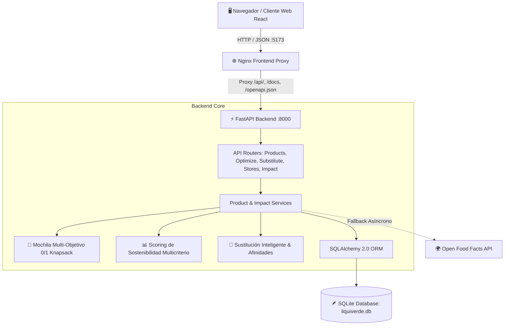

# 🌱 LiquiVerde - Retail Inteligente y Sostenible

> **Desafío Técnico Software Engineer I - Grupo Lagos**  
> Plataforma full-stack para optimización de compras conscientes, maximización del ahorro económico y reducción medible del impacto ambiental y social.

---

## 📋 Tabla de Contenidos
1. [Descripción General](#-descripción-general)
2. [Stack Tecnológico](#-stack-tecnológico)
3. [Arquitectura del Sistema](#-arquitectura-del-sistema)
4. [Explicación Formal de Algoritmos](#-explicación-formal-de-algoritmos)
   - [1. Algoritmo de Mochila Multi-Objetivo (Knapsack)](#1-algoritmo-de-mochila-multi-objetivo-knapsack)
   - [2. Sistema de Scoring de Sostenibilidad Multicriterio](#2-sistema-de-scoring-de-sostenibilidad-multicriterio)
   - [3. Motor de Sustitución Inteligente](#3-motor-de-sustitución-inteligente)
   - [4. Cálculo de Ahorro, Impacto y Metodología de Estimación](#4-cálculo-de-ahorro-impacto-y-metodología-de-estimación)
5. [Instrucciones de Ejecución](#-instrucciones-de-ejecución)
   - [Opción A: Docker Compose (Recomendada / 1 Comando)](#opción-a-docker-compose-recomendada--1-comando)
   - [Opción B: Ejecución Local Manual](#opción-b-ejecución-local-manual)
6. [Variables de Entorno y Configuración](#-variables-de-entorno-y-configuración)
7. [Documentación de APIs & Swagger](#-documentación-de-apis--swagger)
8. [Suite de Pruebas Automatizadas](#-suite-de-pruebas-automatizadas)
9. [Declaración de Uso de Inteligencia Artificial](#-declaración-de-uso-de-inteligencia-artificial)

---

## 🚀 Descripción General

LiquiVerde transforma la experiencia de compra en retail al combinar optimización matemática de canastas con evaluación de impacto ambiental de ciclo de vida. Permite a los consumidores:
- **Escanear códigos de barra EAN-13** o buscar productos en tiempo real, integrando el catálogo local con la red global **Open Food Facts**.
- **Optimizar canastas sujetas a presupuesto** mediante un slider dinámico que equilibra *Ahorro Económico* vs. *Sostenibilidad Ecológica*.
- **Cargar plantillas predefinidas de canasta** (*Desayuno Familiar*, *Aseo del Hogar*, *Canasta Básica Nutritiva*, *Pack Plant-Based*) para evaluar canastas cotidianas en un clic.
- **Recibir recomendaciones automáticas de sustitución** de productos de alto impacto (por ejemplo, reemplazar hamburguesas industriales en bandeja plástica por lentejas locales a granel con menor huella de $CO_2$ y menor costo).
- **Visualizar su impacto acumulado** en un dashboard (árboles equivalentes, agua virtual ahorrada, dinero ahorrado).
- **Ubicar tiendas locales y puntos de recarga circular** (cooperativas agroecológicas, tiendas a granel y centros de reciclaje) en un mapa interactivo con enlace directo de navegación a Google Maps.
- **Experiencia PWA (Progressive Web App):** Instalable como aplicación de escritorio o móvil con visualización *standalone*, prompts de instalación, navegación offline para assets estáticos y Service Worker v2.

---

## 🛠️ Stack Tecnológico

| Capa | Tecnología | Justificación Técnica |
| :--- | :--- | :--- |
| **Backend API** | **Python 3.11+ / FastAPI** | Alto rendimiento asíncrono, validación estricta con **Pydantic v2** y `pydantic-settings`, documentación interactiva **Swagger UI** y soporte nativo para algoritmos matemáticos. |
| **Frontend Web** | **React + Vite** | Interfaz reactiva con renderizado dinámico de sliders, sincronización por hash (`location.hash`), integración nativa con **Leaflet** y sistema de diseño visual con microinteracciones y accesibilidad de teclado. |
| **PWA & Offline** | **Web App Manifest + Service Worker** | Instalación nativa multiplataforma (desktop/móvil), iconos adaptativos, estrategia de caché inteligente para navegación offline y banner en tiempo real ante cortes de red. |
| **Base de Datos** | **SQLite + SQLAlchemy 2.0** | Cero fricción de despliegue, persistencia en volumen Docker (`/app/db`), integridad referencial y desacoplamiento para migrar a PostgreSQL modificando `DATABASE_URL`. |
| **Contenedores** | **Docker & Docker Compose** | Construcción multi-etapa optimizada (Node + Nginx para frontend, Python-slim para backend con healthcheck) lista para levantar en un solo comando. |
| **Pruebas y Linter** | **Pytest & Oxlint** | Suite de 44 tests unitarios y de integración con 100% de éxito, y linter frontend con 0 advertencias. |

---

## 🏗️ Arquitectura del Sistema



---

## 🧮 Explicación Formal de Algoritmos

El núcleo algorítmico está desacoplado en funciones puras testeables dentro de `backend/app/algorithms/`:

### 1. Algoritmo de Mochila Multi-Objetivo (Knapsack)
- **Ubicación:** [backend/app/algorithms/knapsack.py](file:///backend/app/algorithms/knapsack.py)
- **Problema:** Dado un conjunto de productos candidatos $N$, un presupuesto límite $B$ y una preferencia del usuario $\alpha \in [0, 1]$:
  - $\alpha = 0.0$: Prioridad máxima a la economía (mayor accesibilidad económica y menor costo relativo).
  - $\alpha = 1.0$: Prioridad máxima a la sostenibilidad (mayor puntaje ecológico y menor emisión de $CO_2$).
  - $\alpha = 0.5$: Equilibrio inteligente (50% ahorro / 50% planeta).

- **Función de Utilidad Normalizada para el producto $i$:**
  $$E_i = 0.70 \cdot \left(\frac{Score_i}{100}\right) + 0.30 \cdot \max\left(0, 1 - \frac{CO_{2, i}}{10}\right)$$
  $$U_i = 100 \cdot \left(1 - \frac{Precio_i}{P_{max, cat}}\right) \quad \in [0, 100]$$
  $$Valor_i(\alpha) = \alpha \cdot E_i + (1 - \alpha) \cdot \left(\frac{U_i}{100}\right)$$

- **Política de Diversidad:** Se restringe la selección a un único producto por familia funcional (`product_family`), garantizando que la canasta sugerida no se monopolice con variantes del mismo producto.

- **Discretización Segura de Presupuesto:**
  Para resolver la mochila mediante Programación Dinámica (0/1 Knapsack), los precios continuos en pesos se discretizan con **redondeo hacia arriba** estricto:
  $$w_i = \left\lceil \frac{Precio_i}{step} \right\rceil, \quad W = \left\lfloor \frac{B}{step} \right\rfloor$$
  Esto garantiza matemáticamente que la suma de costos discretos nunca supere el presupuesto real del consumidor:
  $$\sum_{i \in Canasta} Precio_i \le B$$

- **Modo Sustitución de Canasta (Multiple-Choice Knapsack):**
  Cuando el usuario optimiza su canasta activa (`items`), el algoritmo modela cada producto original como un slot donde compite contra sus alternativas compatibles. Selecciona la combinación global que maximiza la utilidad neta respetando el presupuesto disponible.

---

### 2. Sistema de Scoring de Sostenibilidad Multicriterio
- **Ubicación:** [backend/app/algorithms/scoring.py](file:///backend/app/algorithms/scoring.py)
- **Formulación:** El puntaje final $Score_{total} \in [0, 100]$ evalúa tres dimensiones balanceadas:
  $$Score_{total} = 0.50 \cdot S_{ambiental} + 0.30 \cdot S_{social} + 0.20 \cdot S_{economico}$$

- **Techos de Emisiones por Categoría ($Techo_{cat}$):**
  Para evaluar objetivamente la huella de carbono según el impacto inherente de cada industria agroalimentaria:
  | Categoría | Techo $CO_2$e (kg) | Categoría | Techo $CO_2$e (kg) |
  | :--- | :---: | :--- | :---: |
  | `carnes_y_proteinas` | 20.0 kg | `frutas_y_verduras` | 2.0 kg |
  | `lacteos_y_vegetales` | 5.0 kg | `limpieza_y_hogar` | 3.0 kg |
  | `abarrotes_y_cereales` | 4.0 kg | `bebidas` | 2.5 kg |
  | `despensa_y_condimentos` | 3.5 kg | `panaderia_y_snacks` | 3.0 kg |

- **Desglose de Subscores:**
  - **$S_{ambiental}$ (50%):**
    $$S_{amb} = \min\left(100, 0.45 \cdot \max\left(0, 1 - \frac{CO_2}{Techo_{cat}}\right) \cdot 100 + 0.35 \cdot Empaque + 0.20 \cdot EcoScore + Bonus_{organico}\right)$$
    Premia empaques retornables/reciclables (90-100 pts), penaliza plásticos convencionales (15-40 pts) y traduce los grados Eco-Score oficiales (A=100, B=80, C=60, D=40, E=20).
  - **$S_{social}$ (30%):**
    Evalúa origen local y cooperativas campesinas chilenas (95-100 pts) vs. importación transoceánica (30-50 pts), otorgando un bono de **+15 puntos** a certificaciones de Comercio Justo.
  - **$S_{economico}$ (20%):**
    Compara el precio unitario del producto con el promedio y la accesibilidad de su categoría.

---

### 3. Motor de Sustitución Inteligente
- **Ubicación:** [backend/app/algorithms/substitution.py](file:///backend/app/algorithms/substitution.py)
- **Compatibilidad Funcional:** Utiliza el campo `product_family` (ej: `leches_y_bebidas_vegetales`, `legumbres`, `detergentes`, `pastas`) y afinidades culinarias predefinidas para garantizar que solo se recomienden alternativas culinariamente intercambiables.
- **Cálculo de Deltas:**
  $$\Delta Precio = Precio_{original} - Precio_{sustituto} \quad \text{(Ahorro monetario)}$$
  $$\Delta CO_2 = CO_{2, original} - CO_{2, sustituto} \quad \text{(Emisiones mitigadas)}$$
  $$\Delta Agua = Agua_{original} - Agua_{sustituto} \quad \text{(Litros de agua virtual conservados)}$$

---

### 4. Cálculo de Ahorro, Impacto y Metodología de Estimación

#### Ahorro Real vs. Ahorro Estimado
1. **Modo Canasta:** Cuando el usuario tiene productos seleccionados en su carrito, el ahorro reportado es **exacto y real**, computado a partir de los precios de los productos en la canasta frente a los sustitutos sugeridos.
2. **Modo Catálogo General:** Cuando se calcula la optimización sobre todo el catálogo sin canasta previa, se computa un ahorro estimado respecto al producto convencional de referencia de la misma familia o la mediana de precio de la categoría ($Baseline_{cat}$).

#### Metodología Offline-First frente a APIs de Terceros
- **Tesco API:** Mencionada históricamente en guías de desarrollo, la API pública de Tesco Labs (`dev.tescolabs.com`) fue **discontinuada** y restringida por Tesco PLC a entornos corporativos internos en Reino Unido; adicionalmente, reflejaba precios en libras esterlinas (£ GBP) de la cadena británica, sin aplicabilidad al mercado minorista chileno.
- **Carbon Interface API:** Está diseñada para estimación de emisiones corporativas a nivel macro (vuelos comerciales, transporte de carga y facturación eléctrica en EE.UU./Canadá mediante API keys privadas y cuotas estrictas), careciendo de base de datos de SKUs minoristas alimentarios de supermercado en Chile.
- **Arquitectura LiquiVerde:** Se diseñó una arquitectura resiliente *offline-first* basada en balances de ciclo de vida (LCA de Agribalyse y CarbonCloud) calibrados en pesos chilenos (CLP), combinada con la ingesta asíncrona de **Open Food Facts** para metadatos nutricionales, marcas y códigos EAN-13. Cuando un producto externo de OFF no reporta precio minorista nacional, la plataforma asigna un valor transparente basado en la baseline de la categoría con la etiqueta `data_quality: estimated`.

---

## 💻 Instrucciones de Ejecución

### Opción A: Docker Compose (Recomendada / 1 Comando)
Asegúrate de tener Docker instalado y en ejecución, y corre desde la raíz del proyecto:

```bash
docker compose up --build
```

- **Frontend Web:** [http://localhost:5173](http://localhost:5173)
- **API Backend & Swagger UI:** [http://localhost:8000/docs](http://localhost:8000/docs)
- **OpenAPI JSON:** [http://localhost:8000/openapi.json](http://localhost:8000/openapi.json)

---

### Opción B: Ejecución Local Manual

#### 1. Backend (Python FastAPI)
```bash
# Entrar al directorio de backend
cd backend

# Crear entorno virtual e instalar dependencias
python -m venv venv
venv\Scripts\activate          # En Windows
# source venv/bin/activate     # En Linux/macOS

pip install -r requirements.txt

# Inicializar y poblar base de datos SQLite
python -m app.db.init_db

# Iniciar servidor FastAPI
uvicorn app.main:app --reload --host 127.0.0.1 --port 8000
```

#### 2. Frontend (React + Vite)
```bash
# En otra terminal, entrar a frontend
cd frontend

# Instalar dependencias
npm install

# Iniciar servidor de desarrollo
npm run dev
```

La aplicación estará disponible en [http://localhost:5173](http://localhost:5173).

> [!NOTE]
> **Prueba del Escáner de Códigos de Barra con Cámara:**  
> Por directivas estrictas de seguridad de los navegadores web modernos (W3C), el acceso a la cámara mediante `navigator.mediaDevices.getUserMedia` está restringido exclusivamente a **contextos seguros** (`https://` o `http://localhost`).  
> - **En PC / Laptop:** Puedes probar el escáner abriendo [http://localhost:5173](http://localhost:5173) y usando tu webcam física. Si estás en una computadora de escritorio sin webcam o deseas simular productos reales, puedes usar una **cámara virtual** (como **OBS Virtual Camera**) transmitiendo la imagen de un código de barras frente al lente virtual.
> - **Desde un Smartphone:** Si accedes por IP local (ej. `http://192.168.x.x:5173`), los navegadores móviles bloquearán los permisos de cámara por falta de HTTPS (requiere túnel con certificado SSL como ngrok o Cloudflare).
> - **Modo Alternativo Rápido:** Dentro del modal del escáner también se incluyen **botones de demostración rápida con 1 click** y un campo de **búsqueda manual por código EAN-13** para testear la funcionalidad sin requerir cámara.

---

## ⚙️ Variables de Entorno y Configuración

El proyecto incluye un archivo de referencia [.env.example](file:///.env.example) en la raíz. Para personalizar la configuración en producción o entornos locales, crea un archivo `.env`:

```bash
cp .env.example .env
```

| Variable | Valor por defecto | Descripción |
| :--- | :--- | :--- |
| `DATABASE_URL` | `sqlite:///./liquiverde.db` | URL de conexión para SQLite o PostgreSQL |
| `PORT` | `8000` | Puerto de escucha de la API |
| `CORS_ORIGINS` | `http://localhost:5173,http://127.0.0.1:5173` | Lista de orígenes autorizados para CORS (separados por comas) |
| `OFF_USER_AGENT` | `LiquiVerde-Chile-App/1.0 (contacto@liquiverde.cl)` | User-Agent requerido por la política de Open Food Facts |
| `VITE_API_URL` | `/api` | Ruta base de la API consumida por el frontend (con proxy en Vite y Nginx) |

---

## 📖 Documentación de APIs & Swagger

Al levantar el backend, FastAPI genera automáticamente la documentación interactiva:
- **Swagger UI:** [http://localhost:8000/docs](http://localhost:8000/docs)
- **ReDoc:** [http://localhost:8000/redoc](http://localhost:8000/redoc)

### Principales Endpoints:
- `GET /api/products`: Catálogo con filtros por texto, categoría, grado Eco-Score, orgánico y comercio justo.
- `GET /api/products/barcode/{barcode}`: Búsqueda y escaneo por código EAN-13 (con fallback asíncrono a Open Food Facts).
- `GET /api/products/{id}`: Detalle de producto con métricas de ciclo de vida.
- `POST /api/optimize/knapsack`: Optimización de canasta con algoritmo de mochila multi-objetivo y sustitución inteligente.
- `GET /api/substitutes/{id}`: Sugerencias de alternativas ecológicas y económicas con cálculo de deltas y explicaciones.
- `GET /api/stores`: Puntos de venta sustentables, granel y cooperativas con coordenadas geográficas para mapa.
- `GET /api/impact/summary`: Métricas agregadas de impacto ambiental y económico de la comunidad.

---

## 🧪 Suite de Pruebas Automatizadas

El backend cuenta con 44 pruebas automatizadas con `pytest` que validan exhaustivamente los contratos HTTP, modelos y algoritmos:

```bash
# Ejecutar suite de pruebas desde el directorio backend
cd backend
pytest tests -v
```

```
============================== test session starts ==============================
collected 44 items

tests/test_api.py ....................                                    [ 45%]
tests/test_classification.py ......                                      [ 59%]
tests/test_knapsack.py ........                                           [ 77%]
tests/test_knapsack_comprehensive.py .....                                [ 88%]
tests/test_product_service.py ..                                          [ 93%]
tests/test_scoring.py ...                                                 [100%]

============================== 44 passed in 0.42s ===============================
```

### Verificación del Frontend:
```bash
# Ejecutar linter en frontend
cd frontend
npm run lint    # 0 warnings, 0 errors

# Validar construcción de producción
npm run build   # Compilación Vite limpia en < 1 segundo
```

---

## 🤖 Declaración de Uso de Inteligencia Artificial

> **En cumplimiento con los requerimientos del Desafío Técnico de Grupo Lagos.**

Para el desarrollo de este proyecto se utilizaron herramientas de asistencia basadas en LLMs (Google DeepMind Gemini / Antigravity IDE) como aceleradores de productividad:

- **Scaffolding y Boilerplate:** Generación de la estructura base inicial de carpetas, esquemas Pydantic y componentes base de React.
- **Generación de Datasets de Prueba:** Compilación inicial de las semillas de productos y tiendas en formato JSON (`products_seed.json`, `stores_seed.json`).
- **Supervisión y Criterio de Ingeniería:** Toda la formulación matemática de los algoritmos (discretización estricta de la mochila con `math.ceil` para evitar desbordes presupuestarios, normalización monótona de utilidad económica, scoring multicriterio de ciclo de vida, afinidad funcional de sustitutos con `product_family`) y la suite completa de 44 pruebas automatizadas fueron diseñadas, auditadas e implementadas con estricto criterio técnico y validación formal.

---

© 2026 LiquiVerde • Retail Inteligente y Sostenible.
